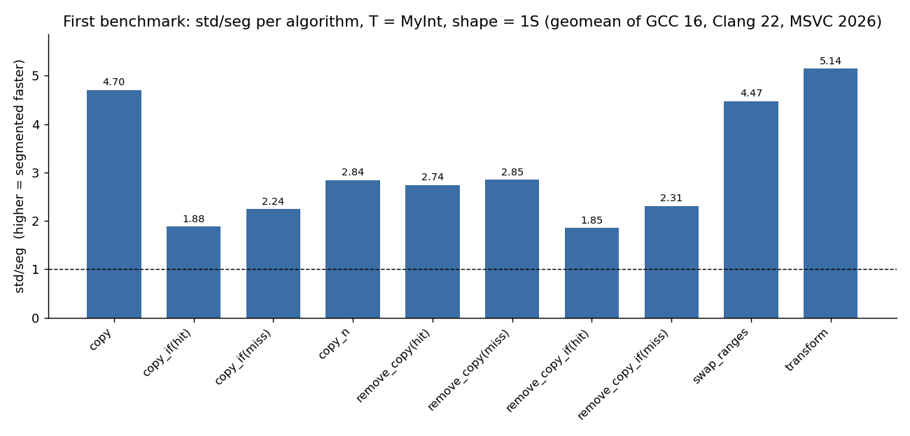
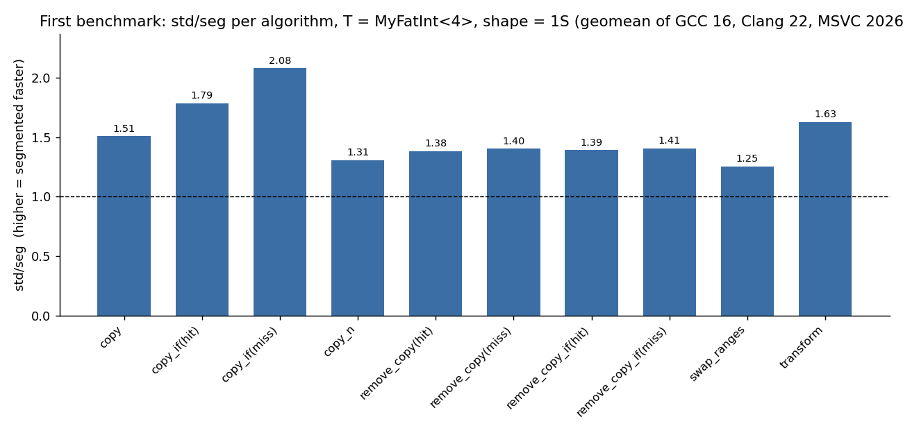
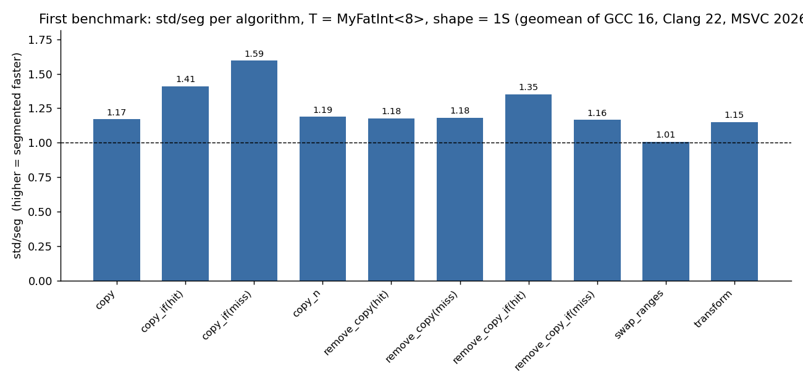
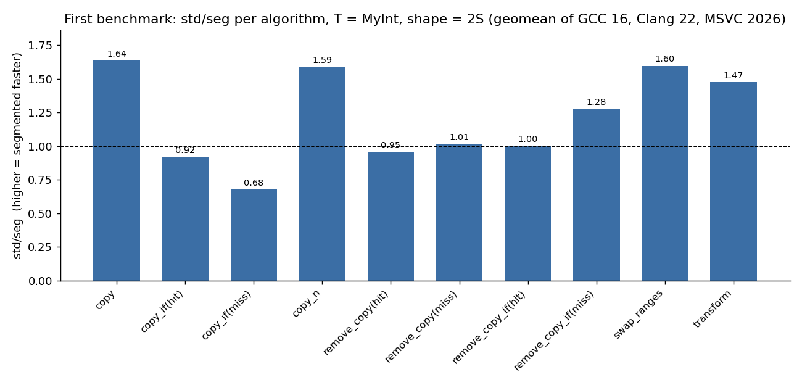
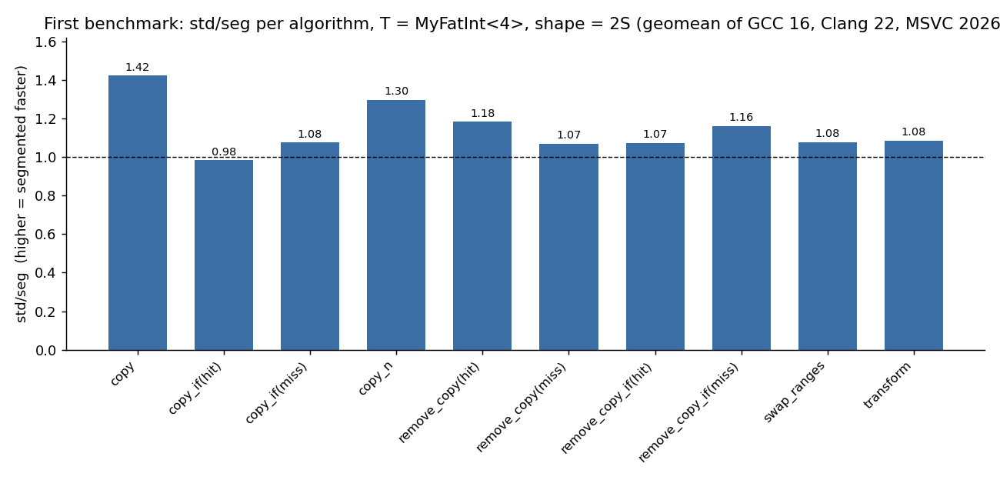
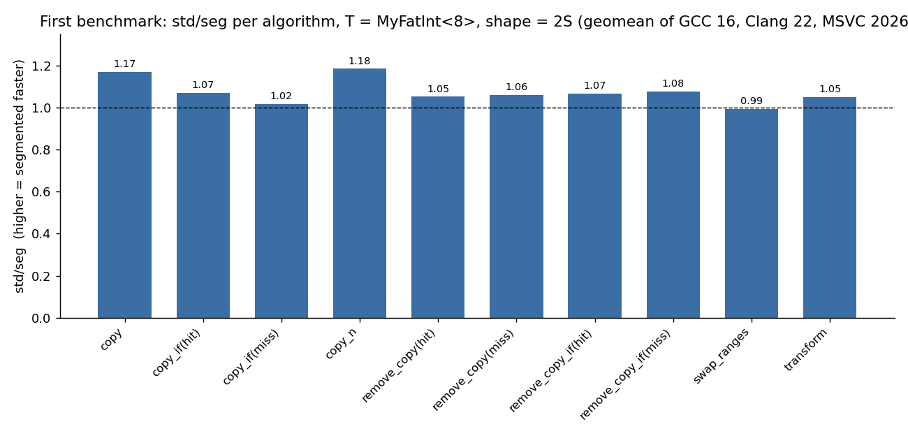
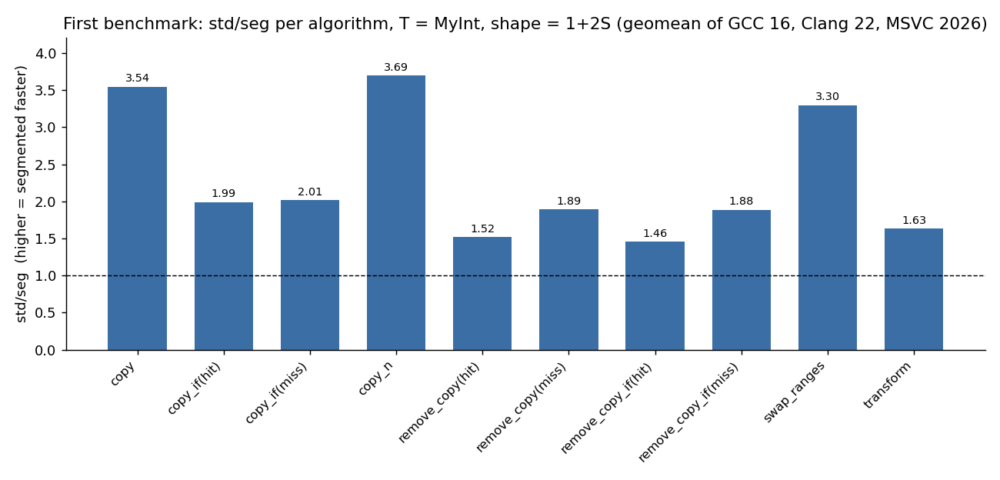
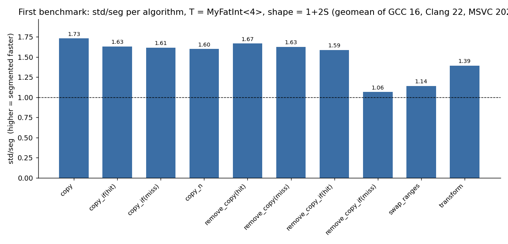
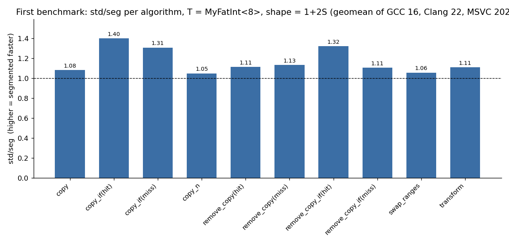

Geomean per compiler, split by shape:

#### Shape `1S` — 1S (segmented input, flat output)

T = `MyInt`:

| Compiler | `nsg/seg` | `std/seg` | `std/nsg` |
| --- | --- | --- | --- |
| GCC 16 | 1.55 | 1.61 | 1.04 |
| Clang 22 | 3.07 | 2.97 | 0.97 |
| MSVC 2026 | 5.12 | 5.15 | 1.00 |

T = `MyFatInt<4>`:

| Compiler | `nsg/seg` | `std/seg` | `std/nsg` |
| --- | --- | --- | --- |
| GCC 16 | 0.96 | 0.97 | 1.01 |
| Clang 22 | 1.38 | 1.23 | 0.90 |
| MSVC 2026 | 2.82 | 2.80 | 0.99 |

T = `MyFatInt<8>`:

| Compiler | `nsg/seg` | `std/seg` | `std/nsg` |
| --- | --- | --- | --- |
| GCC 16 | 1.03 | 1.03 | 1.00 |
| Clang 22 | 1.06 | 1.03 | 0.96 |
| MSVC 2026 | 1.81 | 1.75 | 0.97 |

Per-algorithm for `MyInt`, shape `1S` (geomean of the three compilers; per-compiler breakdowns are in the Annex):

| Algorithm | `nsg/seg` | `std/seg` | `std/nsg` |
| --- | --- | --- | --- |
| `copy` | 4.56 | 4.70 | 1.03 |
| `copy_if(hit)` | 1.90 | 1.88 | 0.99 |
| `copy_if(miss)` | 2.94 | 2.24 | 0.76 |
| `copy_n` | 2.92 | 2.84 | 0.97 |
| `remove_copy(hit)` | 2.32 | 2.74 | 1.18 |
| `remove_copy(miss)` | 2.28 | 2.85 | 1.25 |
| `remove_copy_if(hit)` | 1.88 | 1.85 | 0.98 |
| `remove_copy_if(miss)` | 2.31 | 2.31 | 1.00 |
| `swap_ranges` | 4.64 | 4.47 | 0.96 |
| `transform` | 5.32 | 5.14 | 0.97 |
| **geomean** | **2.90** | **2.91** | **1.00** |

#### Shape `2S` — 2S (flat input, segmented output)

T = `MyInt`:

| Compiler | `nsg/seg` | `std/seg` | `std/nsg` |
| --- | --- | --- | --- |
| GCC 16 | 1.05 | 1.02 | 0.98 |
| Clang 22 | 0.77 | 0.83 | 1.08 |
| MSVC 2026 | 1.86 | 1.88 | 1.01 |

T = `MyFatInt<4>`:

| Compiler | `nsg/seg` | `std/seg` | `std/nsg` |
| --- | --- | --- | --- |
| GCC 16 | 1.04 | 1.04 | 1.00 |
| Clang 22 | 1.03 | 1.04 | 1.01 |
| MSVC 2026 | 1.42 | 1.35 | 0.96 |

T = `MyFatInt<8>`:

| Compiler | `nsg/seg` | `std/seg` | `std/nsg` |
| --- | --- | --- | --- |
| GCC 16 | 1.02 | 1.02 | 1.00 |
| Clang 22 | 1.01 | 1.02 | 1.00 |
| MSVC 2026 | 1.23 | 1.19 | 0.97 |

Per-algorithm for `MyInt`, shape `2S` (geomean of the three compilers; per-compiler breakdowns are in the Annex):

| Algorithm | `nsg/seg` | `std/seg` | `std/nsg` |
| --- | --- | --- | --- |
| `copy` | 1.63 | 1.64 | 1.00 |
| `copy_if(hit)` | 0.93 | 0.92 | 0.99 |
| `copy_if(miss)` | 0.77 | 0.68 | 0.87 |
| `copy_n` | 1.43 | 1.59 | 1.12 |
| `remove_copy(hit)` | 0.96 | 0.95 | 1.00 |
| `remove_copy(miss)` | 1.02 | 1.01 | 0.99 |
| `remove_copy_if(hit)` | 0.97 | 1.00 | 1.03 |
| `remove_copy_if(miss)` | 1.04 | 1.28 | 1.23 |
| `swap_ranges` | 1.49 | 1.60 | 1.07 |
| `transform` | 1.56 | 1.47 | 0.94 |
| **geomean** | **1.14** | **1.17** | **1.02** |

#### Shape `1+2S` — 1+2S (segmented input and output)

T = `MyInt`:

| Compiler | `nsg/seg` | `std/seg` | `std/nsg` |
| --- | --- | --- | --- |
| GCC 16 | 1.36 | 1.36 | 1.00 |
| Clang 22 | 1.97 | 2.04 | 1.03 |
| MSVC 2026 | 3.76 | 3.64 | 0.97 |

T = `MyFatInt<4>`:

| Compiler | `nsg/seg` | `std/seg` | `std/nsg` |
| --- | --- | --- | --- |
| GCC 16 | 1.30 | 1.36 | 1.04 |
| Clang 22 | 1.27 | 1.25 | 0.99 |
| MSVC 2026 | 2.44 | 1.94 | 0.79 |

T = `MyFatInt<8>`:

| Compiler | `nsg/seg` | `std/seg` | `std/nsg` |
| --- | --- | --- | --- |
| GCC 16 | 1.08 | 1.09 | 1.01 |
| Clang 22 | 1.16 | 1.15 | 0.99 |
| MSVC 2026 | 1.75 | 1.25 | 0.71 |

Per-algorithm for `MyInt`, shape `1+2S` (geomean of the three compilers; per-compiler breakdowns are in the Annex):

| Algorithm | `nsg/seg` | `std/seg` | `std/nsg` |
| --- | --- | --- | --- |
| `copy` | 3.54 | 3.54 | 1.00 |
| `copy_if(hit)` | 2.09 | 1.99 | 0.95 |
| `copy_if(miss)` | 2.07 | 2.01 | 0.97 |
| `copy_n` | 3.42 | 3.69 | 1.08 |
| `remove_copy(hit)` | 1.54 | 1.52 | 0.98 |
| `remove_copy(miss)` | 1.93 | 1.89 | 0.98 |
| `remove_copy_if(hit)` | 1.43 | 1.46 | 1.02 |
| `remove_copy_if(miss)` | 1.90 | 1.88 | 0.99 |
| `swap_ranges` | 3.20 | 3.30 | 1.03 |
| `transform` | 1.62 | 1.63 | 1.00 |
| **geomean** | **2.16** | **2.16** | **1.00** |

