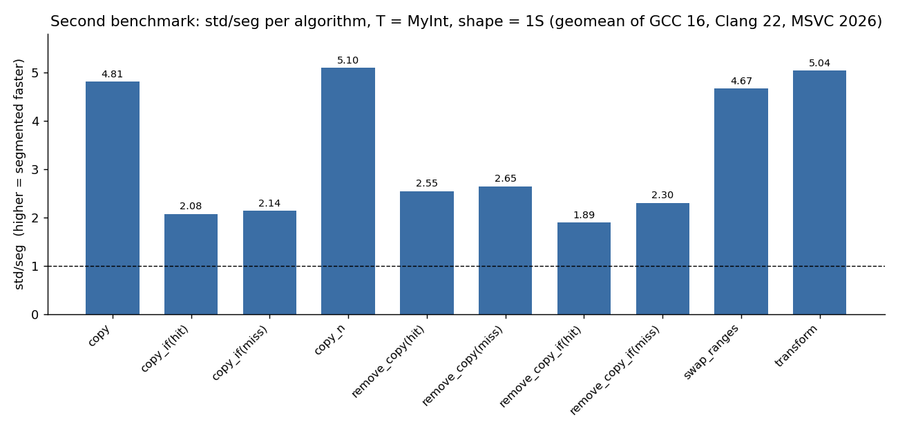
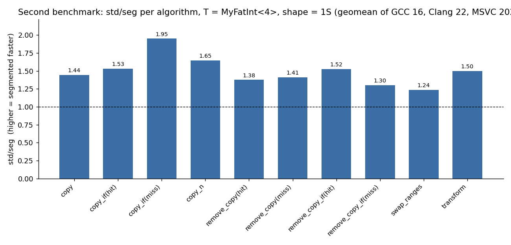
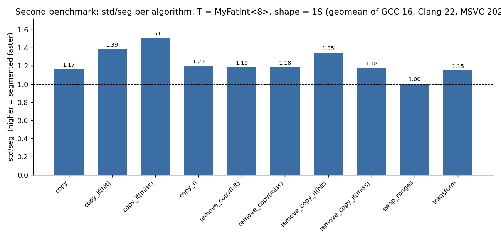
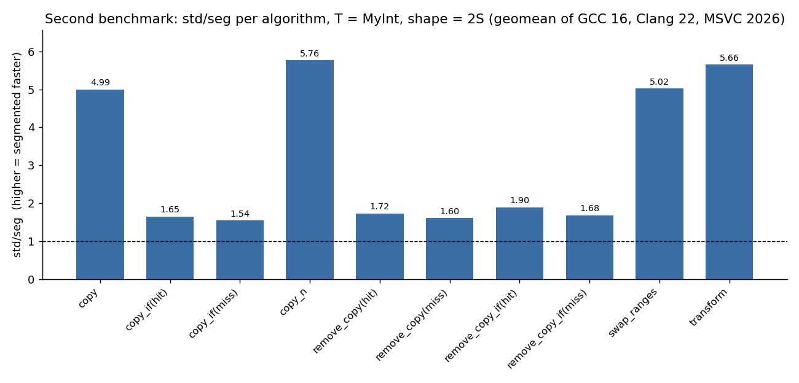
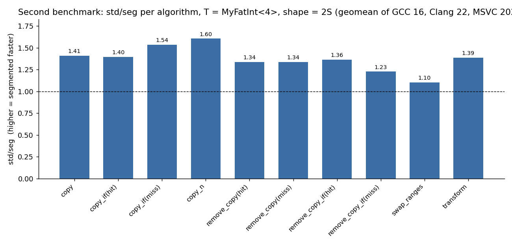
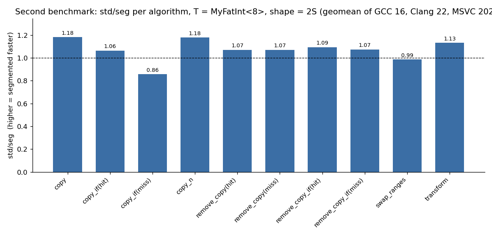
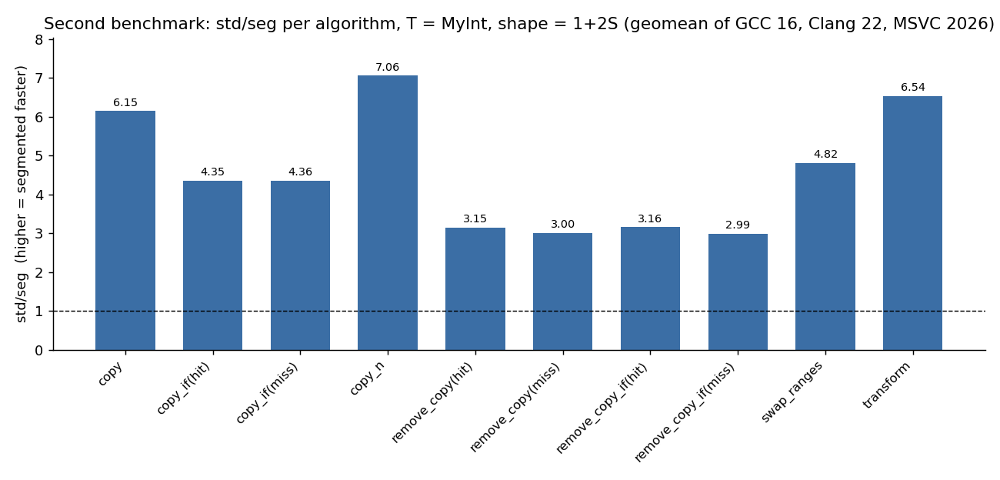
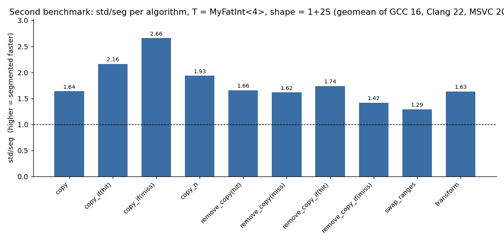
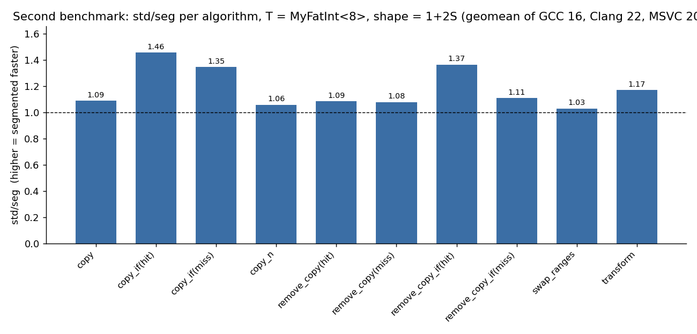

Geomean per compiler, split by shape:

#### Shape `1S` — 1S (segmented input, flat output)

T = `MyInt`:

| Compiler | `nsg/seg` | `std/seg` | `std/nsg` |
| --- | --- | --- | --- |
| GCC 16 | 1.92 | 1.87 | 0.97 |
| Clang 22 | 3.01 | 2.95 | 0.98 |
| MSVC 2026 | 5.29 | 5.27 | 1.00 |

T = `MyFatInt<4>`:

| Compiler | `nsg/seg` | `std/seg` | `std/nsg` |
| --- | --- | --- | --- |
| GCC 16 | 0.99 | 1.05 | 1.06 |
| Clang 22 | 1.41 | 1.18 | 0.84 |
| MSVC 2026 | 2.65 | 2.64 | 0.99 |

T = `MyFatInt<8>`:

| Compiler | `nsg/seg` | `std/seg` | `std/nsg` |
| --- | --- | --- | --- |
| GCC 16 | 1.01 | 1.02 | 1.01 |
| Clang 22 | 1.09 | 1.04 | 0.95 |
| MSVC 2026 | 1.79 | 1.74 | 0.97 |

Per-algorithm for `MyInt`, shape `1S` (geomean of the three compilers; per-compiler breakdowns are in the Annex):

| Algorithm | `nsg/seg` | `std/seg` | `std/nsg` |
| --- | --- | --- | --- |
| `copy` | 4.89 | 4.81 | 0.98 |
| `copy_if(hit)` | 2.08 | 2.08 | 1.00 |
| `copy_if(miss)` | 2.61 | 2.14 | 0.82 |
| `copy_n` | 5.25 | 5.10 | 0.97 |
| `remove_copy(hit)` | 2.48 | 2.55 | 1.02 |
| `remove_copy(miss)` | 2.45 | 2.65 | 1.08 |
| `remove_copy_if(hit)` | 1.90 | 1.89 | 1.00 |
| `remove_copy_if(miss)` | 2.19 | 2.30 | 1.05 |
| `swap_ranges` | 4.68 | 4.67 | 1.00 |
| `transform` | 5.37 | 5.04 | 0.94 |
| **geomean** | **3.13** | **3.07** | **0.98** |

#### Shape `2S` — 2S (flat input, segmented output)

T = `MyInt`:

| Compiler | `nsg/seg` | `std/seg` | `std/nsg` |
| --- | --- | --- | --- |
| GCC 16 | 2.78 | 2.81 | 1.01 |
| Clang 22 | 2.56 | 2.61 | 1.02 |
| MSVC 2026 | 2.59 | 2.59 | 1.00 |

T = `MyFatInt<4>`:

| Compiler | `nsg/seg` | `std/seg` | `std/nsg` |
| --- | --- | --- | --- |
| GCC 16 | 1.30 | 1.32 | 1.02 |
| Clang 22 | 1.24 | 1.30 | 1.05 |
| MSVC 2026 | 1.55 | 1.47 | 0.95 |

T = `MyFatInt<8>`:

| Compiler | `nsg/seg` | `std/seg` | `std/nsg` |
| --- | --- | --- | --- |
| GCC 16 | 1.03 | 1.03 | 1.00 |
| Clang 22 | 1.03 | 1.03 | 1.00 |
| MSVC 2026 | 1.19 | 1.14 | 0.96 |

Per-algorithm for `MyInt`, shape `2S` (geomean of the three compilers; per-compiler breakdowns are in the Annex):

| Algorithm | `nsg/seg` | `std/seg` | `std/nsg` |
| --- | --- | --- | --- |
| `copy` | 4.99 | 4.99 | 1.00 |
| `copy_if(hit)` | 1.64 | 1.65 | 1.01 |
| `copy_if(miss)` | 1.44 | 1.54 | 1.08 |
| `copy_n` | 5.10 | 5.76 | 1.13 |
| `remove_copy(hit)` | 1.78 | 1.72 | 0.97 |
| `remove_copy(miss)` | 1.62 | 1.60 | 0.99 |
| `remove_copy_if(hit)` | 1.86 | 1.90 | 1.02 |
| `remove_copy_if(miss)` | 1.87 | 1.68 | 0.90 |
| `swap_ranges` | 4.67 | 5.02 | 1.08 |
| `transform` | 5.88 | 5.66 | 0.96 |
| **geomean** | **2.64** | **2.67** | **1.01** |

#### Shape `1+2S` — 1+2S (segmented input and output)

T = `MyInt`:

| Compiler | `nsg/seg` | `std/seg` | `std/nsg` |
| --- | --- | --- | --- |
| GCC 16 | 3.24 | 3.24 | 1.00 |
| Clang 22 | 4.02 | 3.89 | 0.97 |
| MSVC 2026 | 6.67 | 6.45 | 0.97 |

T = `MyFatInt<4>`:

| Compiler | `nsg/seg` | `std/seg` | `std/nsg` |
| --- | --- | --- | --- |
| GCC 16 | 1.53 | 1.58 | 1.03 |
| Clang 22 | 1.56 | 1.62 | 1.04 |
| MSVC 2026 | 2.59 | 2.06 | 0.79 |

T = `MyFatInt<8>`:

| Compiler | `nsg/seg` | `std/seg` | `std/nsg` |
| --- | --- | --- | --- |
| GCC 16 | 1.09 | 1.09 | 1.00 |
| Clang 22 | 1.16 | 1.16 | 1.00 |
| MSVC 2026 | 1.81 | 1.28 | 0.71 |

Per-algorithm for `MyInt`, shape `1+2S` (geomean of the three compilers; per-compiler breakdowns are in the Annex):

| Algorithm | `nsg/seg` | `std/seg` | `std/nsg` |
| --- | --- | --- | --- |
| `copy` | 6.44 | 6.15 | 0.96 |
| `copy_if(hit)` | 4.34 | 4.35 | 1.00 |
| `copy_if(miss)` | 4.50 | 4.36 | 0.97 |
| `copy_n` | 6.69 | 7.06 | 1.06 |
| `remove_copy(hit)` | 3.04 | 3.15 | 1.04 |
| `remove_copy(miss)` | 3.02 | 3.00 | 1.00 |
| `remove_copy_if(hit)` | 3.38 | 3.16 | 0.93 |
| `remove_copy_if(miss)` | 3.03 | 2.99 | 0.99 |
| `swap_ranges` | 5.48 | 4.82 | 0.88 |
| `transform` | 6.72 | 6.54 | 0.97 |
| **geomean** | **4.43** | **4.33** | **0.98** |

